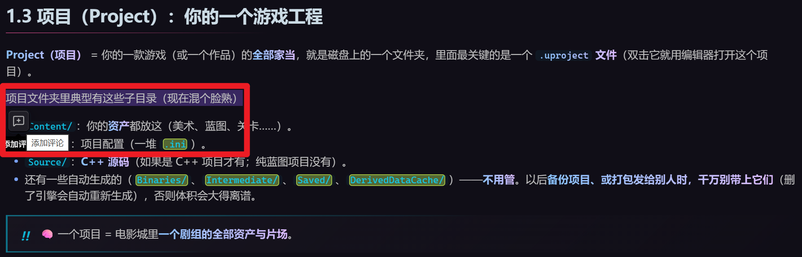
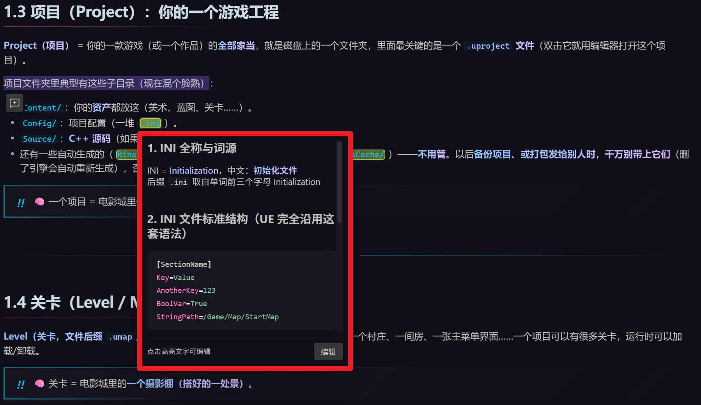

# Lemon Comments

[中文](#lemon-comments) · [English](#lemon-comments-english)

为 Obsidian 阅读模式添加轻量、非侵入式的 Markdown 文本评论。

选中文字后，Lemon Comments 只显示一个迷你工具栏，不会抢走原生选区；你仍然可以复制文字、打开右键菜单或继续调整选区。点击评论图标后，才会打开评论编辑器。



保存评论后，原文会显示柠檬绿色圆角高亮。只有鼠标悬停在高亮文字上时，评论弹窗才会出现；评论内容使用 Obsidian 原生 Markdown 渲染器。



## 功能

- 阅读模式选区工具栏，不干扰复制、右键菜单等原生操作。
- 评论支持 Obsidian 原生 Markdown，包括标题、列表、代码块和链接。
- `Enter` 保存，`Shift+Enter` 换行，`Esc` 取消。
- 点击编辑器外部自动保存。
- 编辑器底部的取消、保存与删除操作始终可见。
- 评论内容增长时，编辑弹窗会重新比较上下空间并自动切换到更合适的一侧。
- 悬停高亮文字查看评论，点击高亮文字编辑。
- 柠檬绿色圆角高亮，可自定义颜色。
- 新增、编辑与悬停阅读弹窗共用可配置的宽度、高度及自动适应内容模式。
- 支持触屏点击查看与键盘操作。
- 支持 en-US 与简体中文；Obsidian 使用中文时自动显示简体中文，其余语言使用 en-US。
- 文件重命名时自动迁移评论数据。
- 退出并重新打开 Obsidian 后自动恢复评论与高亮。
- 正文发生小范围调整后，使用文本与上下文锚点重新定位评论。
- 相同关键词出现多次时，使用前后文只定位最初选中的实例；上下文不足时宁可显示为未定位，也不会误挂到其他同词位置。
- 通过命令面板运行“管理当前笔记的阅读评论”，集中编辑或删除评论。

## 数据存储

评论保存在插件的 `data.json` 中，不会向 Markdown 正文插入 HTML、标记或隐藏语法。

这意味着原始笔记始终保持干净；如需在多台设备间同步评论，请同时同步 Obsidian 插件数据。

## 安装

当前可手动安装：

1. 下载或克隆本仓库。
2. 将仓库放到 Vault 的 `.obsidian/plugins/lemon-comments/`。
3. 确认目录中包含 `main.js`、`manifest.json` 和 `styles.css`。
4. 在 Obsidian 的“设置 → 第三方插件”中启用 **Lemon Comments**。

要求 Obsidian 1.8.7 或更高版本。

## 设置

在“设置 → Lemon Comments”中可以调整：

- 高亮颜色
- 悬停显示延迟
- 评论弹窗默认宽度
- 评论弹窗默认高度
- 阅读弹窗智能自适应
- 自适应最大宽度与高度（默认各占 Obsidian 窗口的 60%）

开启“阅读弹窗智能自适应”后，弹窗始终紧贴高亮文字的上方或下方，绝不居中或覆盖高亮。插件会先尝试以原字号完整展示评论；如果两侧都放不下，则选择空间更大的一侧，并在配置的最大窗口比例内滚动，不会缩小文字。

## 当前限制

- 仅在阅读模式中创建和显示评论。
- 暂不支持对嵌入内容、代码块或公式添加评论。
- 评论选区不能与已有评论重叠。

## 开发

```bash
npm install
npm run dev
```

生产构建：

```bash
npm run build
```

## 许可证

[MIT](LICENSE)

---

# Lemon Comments (English)

Add lightweight, non-intrusive Markdown comments to text in Obsidian Reading view.

After you select text, Lemon Comments displays a small toolbar without taking focus away from the native selection. You can still copy the text, open the context menu, or adjust the selection. The comment editor opens only after you select the comment button.


After you save a comment, the selected text receives a rounded lemon-green highlight. The comment popup appears only while you hover over the highlighted text, and its content is rendered with Obsidian's native Markdown renderer.


## Features

- A Reading view selection toolbar that preserves native copying, context menus, and selection adjustment.
- Native Obsidian Markdown rendering for headings, lists, code blocks, links, and more.
- `Enter` to save, `Shift+Enter` for a new line, and `Esc` to cancel.
- Automatic saving when you click outside the editor.
- Cancel, save, and delete actions remain visible in a sticky editor footer.
- As comment content grows, the editor compares the available space again and switches to the better side of the selection.
- Hover over highlighted text to read a comment; click the highlight to edit it.
- Rounded lemon-green highlights with a configurable color.
- Shared configurable width, height, and content-aware sizing for create, edit, and hover popups.
- Touch interaction and keyboard accessibility.
- en-US and Simplified Chinese localization. Chinese Obsidian installations use Simplified Chinese automatically; all other languages use en-US.
- Automatic comment-data migration when a note is renamed.
- Automatic restoration of comments and highlights after restarting Obsidian.
- Text and surrounding-context anchors that relocate comments after small note edits.
- Repeated keywords are disambiguated by surrounding context. If the context is insufficient, a comment remains unlocated instead of attaching to the wrong occurrence.
- A Command palette action for managing, editing, or deleting comments in the current note.

## Data storage

Comments are stored in the plugin's `data.json`. Lemon Comments does not insert HTML, markers, or hidden syntax into your Markdown notes.

Your source notes remain clean. To use the same comments on multiple devices, sync the Obsidian plugin data as well as your notes.

## Installation

Manual installation:

1. Download or clone this repository.
2. Place it at `.obsidian/plugins/lemon-comments/` inside your Vault.
3. Make sure the directory contains `main.js`, `manifest.json`, and `styles.css`.
4. Enable **Lemon Comments** under **Settings → Community plugins** in Obsidian.

Lemon Comments requires Obsidian 1.8.7 or later.

## Settings

Under **Settings → Lemon Comments**, you can configure:

- Highlight color
- Hover delay
- Default popup width
- Default popup height
- Smart reading-popup sizing
- Maximum adaptive width and height (60% of the Obsidian window by default)

When smart sizing is enabled, the popup always remains anchored directly above or below the highlighted text. It never falls back to the center or covers the highlight. The plugin first tries to show the complete comment at its normal font size. If neither side has enough room, it uses the side with more available space and scrolls within the configured maximum window percentages instead of shrinking the text.

## Current limitations

- Comments can only be created and displayed in Reading view.
- Embedded content, code blocks, and formulas cannot currently be commented.
- A new comment selection cannot overlap an existing comment.

## Development

```bash
npm install
npm run dev
```

Production build:

```bash
npm run build
```

## License

[MIT](LICENSE)
